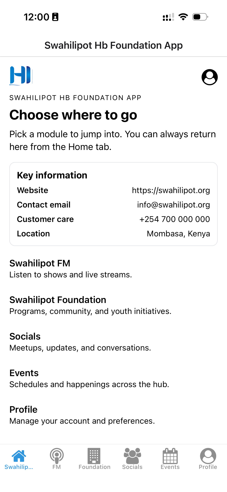
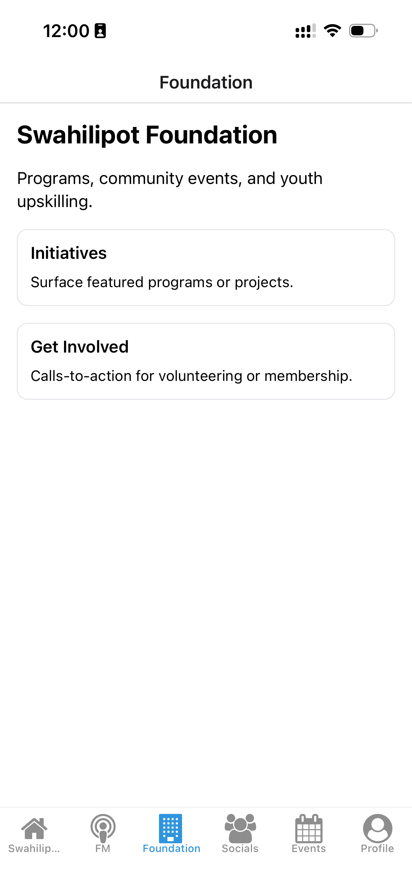
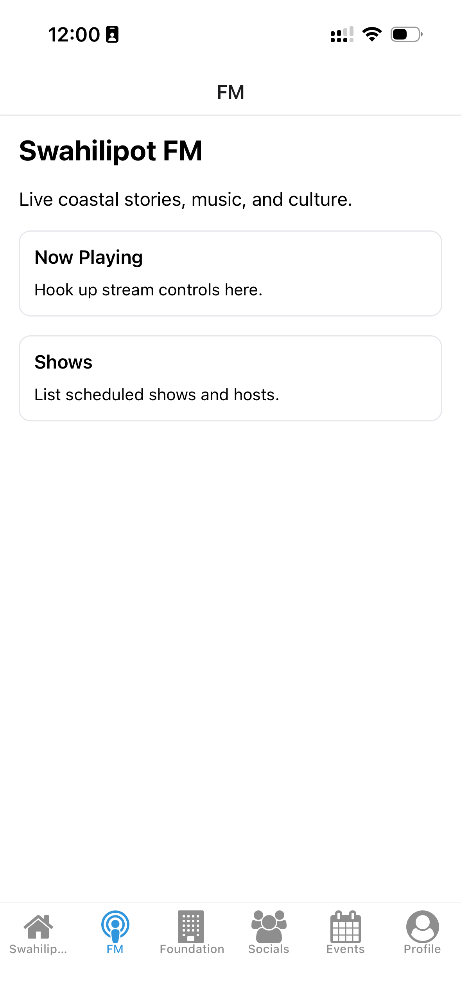
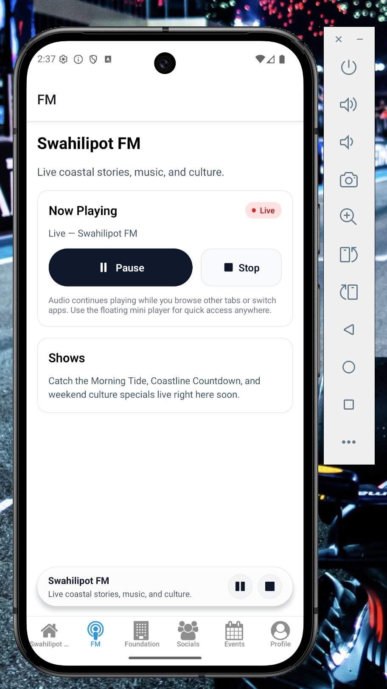
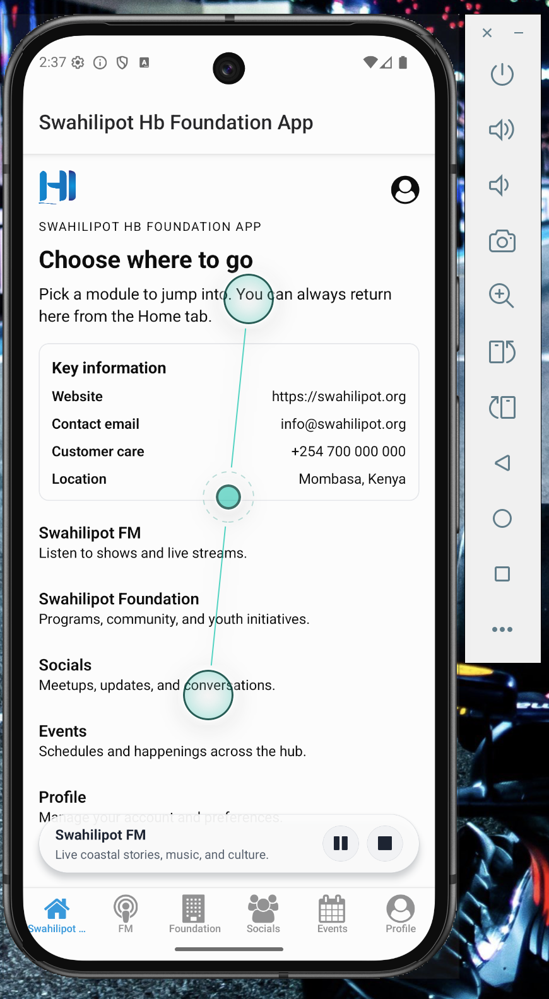
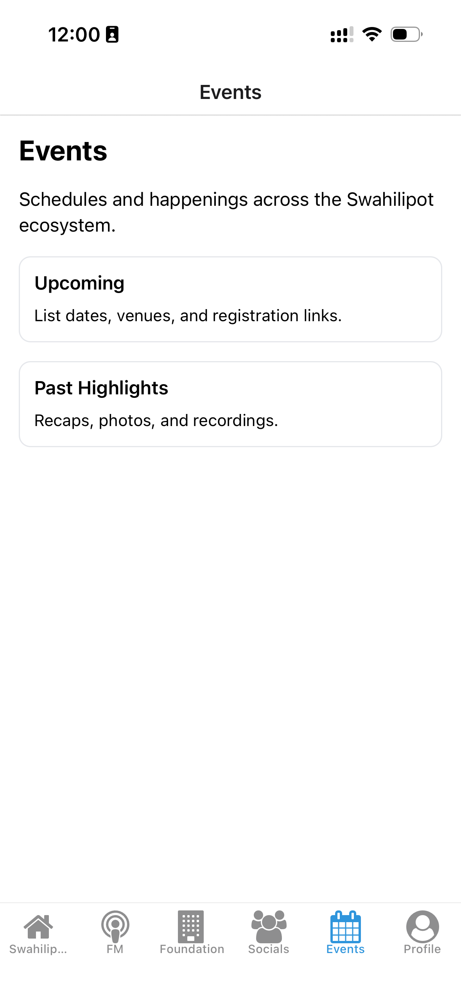
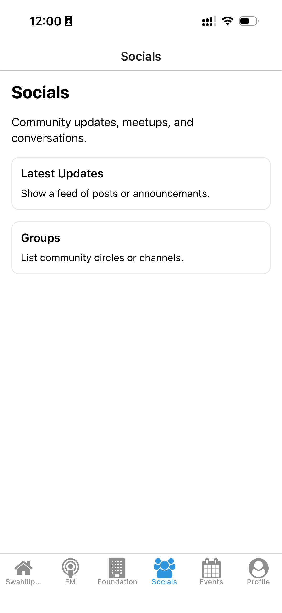
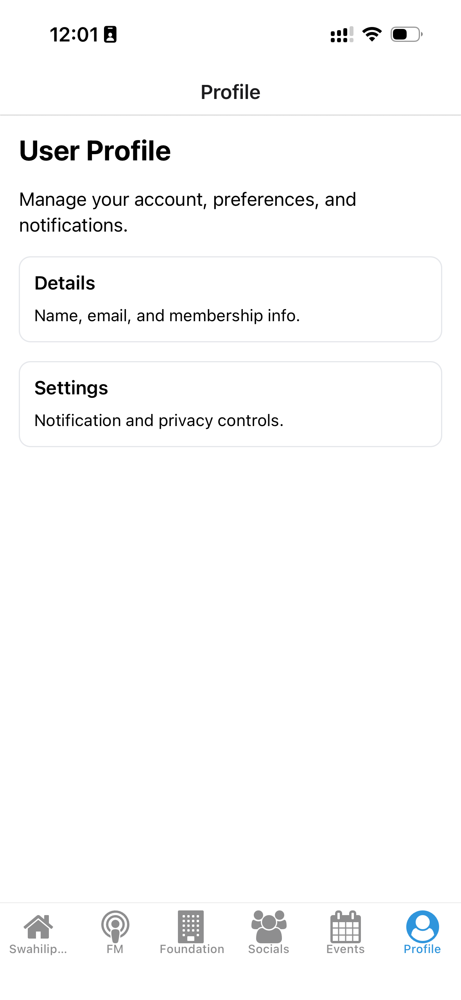

# App Documentation

This document contains a set of screenshots for the app. Images are stored in `docs/assets/images` and referenced relative to this file.

## Screenshots

Below are screenshots demonstrating the app's main screens.

### Landing

### Home / SPHF

### FM

#### FM Playback (Mini Player)

#### FM Playback (Playing)

### Events

### Socials

### Profile

---

>If you add or rename images, update the paths above so they remain relative to `docs/README.md`.
